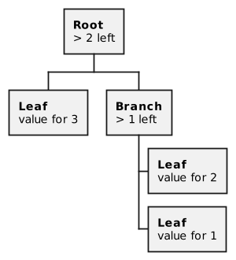

# TL-B and BoC

## BoC

All data in ES is stored and sent in a structure called the BoC (Bag of cell). This is a confusing structure invented by Nikolai Durov, and it’s not very clear whether it was necessary in order to create the blockchain, or Nikolai over-engineered here. In general, all data stored in the contract (not the code, the code is separate, but also the BoC is stored in the contract :-)) is stored in one BoC, this is a given cell (TVMCell) with links to subcells. The TVMCell is a structure that has 1023 Bits of data and 4 references to its child cells. A cell reference is the HASH of that cell. With ES have have a singly connected graph, where each node can have 4 descendants. And we need to pack all smart contract data or messages into a cell with sub cells. Thank God, by using Ton Solidty and knowing the interfaces of contracts, you don’t have to manually pack and unpack cells. The compiler will do everything for you. However, there are rare cases when you will have to do it yourself. In order to do this, there are special primitives in Solidity. When this is necessary, you simply declare state variables in Solidity and read and write to them as usual. The compiler will pack and unpack everything in the BoC for you.

Some BoC properties to understand. BoC is an acyclic graph. The link to a cell c is a hash of its data and its hash links to subcells. So we cannot create a cycle. (Because if we add a link from the parent cell to the child cell, then, by doing so, we recalculate all hashes from the changed cell to the root cell and the link to the parent cell changes). The entire state of the contract is BoC. This is one cell with as many child cells as you like. Ton Solidity takes care of work with states for us, but you need to understand that, because of ES’s tree structure, we normally don’t write contracts with a lot of data. In order to illustrate how it works, consider (schematically) how a dictionary could be implemented in BoC.

Each circle in the picture is a separate cell. To get the value by key 2, TVM needs to load a cell of depth 0, then depth 1 and then depth 2. We have to pay gas for each time a cell is loaded. And if we change the value by key two, we will need to recalculate all references from the cell with the value of the root cell because the cell reference is a hash (cell.data + cell.refs).

So, links to all cells along the way will change and we will need to change them from bottom to top. So, the more elements our dictionary has, the deeper the cell will be and the more expensive it will be to work with. For a dictionary, the cost of gas will increase to O(log n) in a worst case scenario. (In reality, everything would be more complicated but O (log n) can be useful to look at as a worst case scenario).

Now, if we are creating an ERC20 token, then the more owners this token has, the more expensive the gas will be to use this contract (the size of the owner-number map will grow). And although O(Log n) doesn’t sound scary at all, and the cost of working with the map will increase very, very slowly after the first hundred elements, and then even slower after that, in ES there we have a storage fee that grows linearly.

If you have accounts in your ERC-20 token that contain pennies, then the fees for holding these accounts will greatly exceed the value of these accounts over the years. Therefore, in ES it is customary to make separate contracts for separate accounts, which themselves pay for their storage. We will look at how the [TIP-3](../spec/standards/TIP-3/) standard (a distributed replacement for ERC-20) works in the next chapter.

Fun fact: this entire overcomplicated data storage scheme helps to scale the network, so that the validator can quickly execute smart contracts. Validators do not need to store the entire current state of the blockchain in Ram, because loading the smart contract state from the disk will be fast, since all smart contracts are small. Additionally, since all contracts are small, they are evenly distributed across all shards.