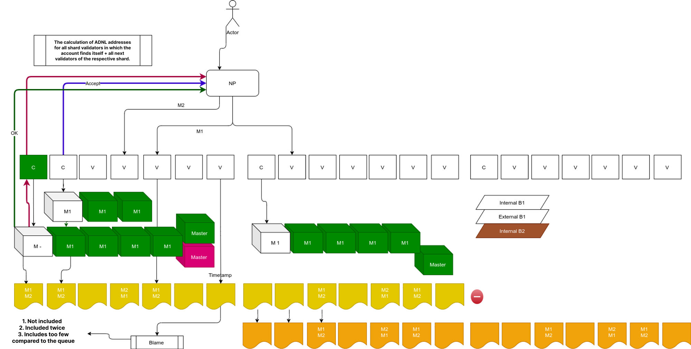

# REMP Overview

REMP is a set of protocols and data structures designed to trace incoming **external messages**. Its main purpose is to guarantee that messages are delivered from any network participant in a particular order in less than a second. That is to say, when a message is sent to the network, it gets accepted by current validators and included in the message queue catchain **(MQC)** with a timestamp. The validators send a confirmation to the user about the message receipt. Afterwards, the message is guaranteed to be included in the block. Even if the block production fails **(an extremely rare situation)**, the message will be included in the same order it was received in the next block. In case the message fails to be included in the block, all validators are punished by the means of stake reduction. 

REMP also provides some vital security mechanisms for external message processing:

**1. Replay protection**

If a message is processed and it is included in a newly created block, then the same message **(that is, the message with the same hash)** will not be collated for some time period. This makes the replay protection efficient.

**2. A message may be sent only once**

If there is the possibility to accept it and include it in a block, then it will be done. No messages are lost — except for blockchain overloading reasons.

**3. Message processing tracing**

There are three checkpoints on the message processing route: validators receive the message, the message is added to a block, the block is created.  

Depending on the message importance, one may trade efficiency for reliability in the software. Most messages can be considered processed when validators acknowledge that they were received **(100-200 ms)**. After that, it’s highly unlikely that the message will be declined. On the other hand, if a transaction is really important, then its better to wait till the block with the transaction result is created.

**There is a significant difference between validation and REMP Catchain sessions.**

The validation catchain session is conducted among validators currently validating a given shard. The REMP catchain session, in turn, is conducted among validators of a given shard and validators that validated this shard in the previous session. That is, the number of participants in the REMP catchain session is twice compared with the validation session. The reason for this is the necessity to pass **RMQ** data between sessions with respect to current network bandwidth. So, each newly created REMP catchain session includes validators from the previous validation catchain session that provide reliable RMQ data for validators from the current validation catchain session.

Besides the REMP Catchain protocol, there is communication between the outer world of the blockchain and shard validators. It is provided by **REMP Client protocol**. The protocol can run as part of some blockchain node. 

It provides the following:
- Reception of external messages from the outer world
- Pre-evaluation of received messages against the current state of the destination shard **(to filter out invalid messages)**
- Transfer of messages to each current validator of a given shard to include it in their REMP catchain
- Reception of status updates from shard validators for all previously transferred messages
- Reporting message statuses to the outer world

If at least 1/3 + 1 validators receive the message via the REMP Client protocol, then at least one “good” validator processes it and re-sends it to all other validators via the REMP catchain session.

The message life-time is counted according to the master catchain sequence numbers. If a message is received when the master catchain N is in action, then it becomes obsolete for master catchain N+2. Such messages are not transmitted to new catchain sessions anymore.

Each validator tries to collate the message until its collator rejects the attempt.

Therefore, the message processing may result in three outcomes:
- **Accepted by the validator** - it is validated and included into a shard block
- **Rejected by the full node** - or by all validators 
- **Futile validation attempts** - the message becomes obsolete 

This provides for hard replay protection guarantees. Namely, if the message has an expiration mechanism included, it makes the message obsolete before two catchain sessions switch. Thus, the soft processing guarantees in the form of **(collation/validation)** attempts may be futile if the message is wrong or if the blockchain is overloaded.

**Performance**

REMP performance may be split into two: network and processor. The impact of processor performance is very limited. This is due to messages not being processed by REMP itself. It only keeps track of all external messages. Moreover, replay protection may even reduce processor load. That’s due to messages being rejected before collation if they are already processed. It thus removes the necessity to execute contracts’ replay protection code.

Network performance, on the other hand, is impacted by catchain sessions **(remember, each catchain session is doubled)**. It can be expensive from the network load perspective. Thus, in theory, it may delay the network up to 50%. Of course, real-life delays will be much smaller. The real performance depends on the contracts’ details, and some other factors.